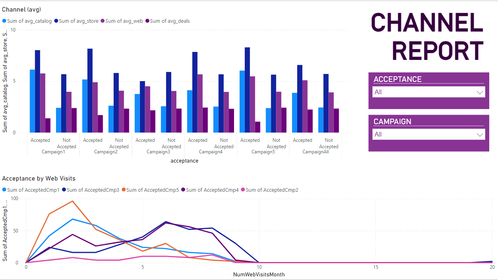

# Project Overview

As a marketing analyst at our company, you've been informed by the Chief Marketing Officer that recent marketing campaigns haven't achieved expected outcomes. Your task is to dive into the dataset to uncover the root causes and propose actionable, data-driven solutions.

## Table of Contents
- [Technologies Used](#technologies-used)
- [Data Source](#data-source)
- [Workflow Description](#workflow-description)
  - [Architecture](#architecture)
  - [Methodology](#methodology)
  - [Visualization & Reporting](#visualization--reporting)
  - [Presentation](#presentation)
- [Setup Instructions](#setup-instructions)
- [Contributing](#contributing)
- [License](#license)

## Technologies Used
- **Python**: For data processing and analysis.
- **SQL**: For querying and aggregating data.
- **Visualization Tools**: For creating insightful data visualizations (PowerBI used here).

## Data Source
- **CSV File**: [ifood_df.csv](./dags/resources/data/source/ifood_df.csv) (`dags/resources/data/source/ifood_df.csv`)


## Workflow Description

### 1. Architecture
The project's architecture involves several components which are detailed in the architecture diagram below.


### 2. Methodology

#### Data Analysis
Initial data exploration is conducted using Jupyter Notebooks:
- **Notebook**: [data_analysis.ipynb](./Notebooks/data_analysis.ipynb) (`Notebooks/data_analysis.ipynb`)

#### ETL Process
An ETL pipeline built with Airflow orchestrates the data transformation and loading:
- **Bronze Stage**: Processes raw CSV data for initial cleaning.
- **Silver Stage**: Performs further data enrichment and transformation.
- **Gold Stage**: Aggregates data for detailed campaign analysis.


#### Data Insights
Further exploratory data analysis (EDA) is done to draw insights from processed data:
- **Notebook**: [eda.ipynb](./Notebooks/eda.ipynb) (`Notebooks/eda.ipynb`) 

### 3. Visualization & Reporting
Data visualizations and reports are generated using PowerBI to present findings and insights effectively.





### 4. Presentation
Final findings and recommendations are compiled into a presentation:
- **Presentation File**: [View Presentation](./ifood_presentation.pdf)


## Setup Instructions

### Requirements
- Python
- Docker
- pgAdmin
- PowerBI

### Project Setup
Run the following command within the project directory to start all services using Docker:
```bash
docker compose up
```

#### Accessing Services
- Airflow: http://localhost:8080/login/ (Username: airflow, Password: airflow)
- Postgres: Access through pgAdmin (Username: airflow, Password: airflow)


## Contributing
If you would like to contribute to the project, please follow these steps:

1. Fork the repository.
2. Create a new branch (`git checkout -b feature-branch`).
3. Make your changes.
4. Commit your changes (`git commit -am 'Add some feature'`).
5. Push to the branch (`git push origin feature-branch`).
6. Create a new Pull Request.

## License
This project does not currently specify a license and the rights are reserved until further notice. Please contact the project administrator for more details (monicachadasa@hotmail.com).